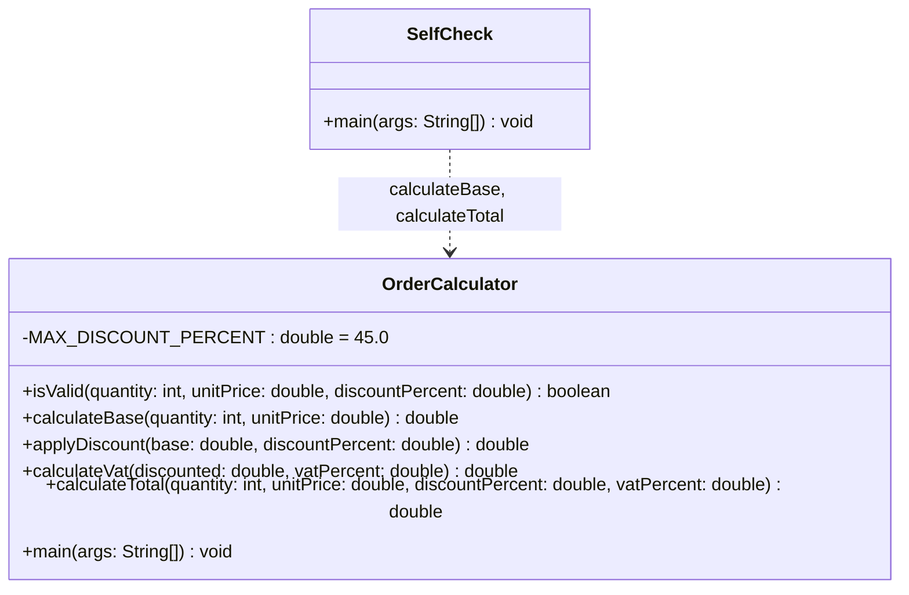

# Диаграмма классов

```mermaid
classDiagram
    class OrderCalculator {
        -MAX_DISCOUNT_PERCENT : double = 45.0
        +isValid(quantity: int, unitPrice: double, discountPercent: double) boolean
        +calculateBase(quantity: int, unitPrice: double) double
        +applyDiscount(base: double, discountPercent: double) double
        +calculateVat(discounted: double, vatPercent: double) double
        +calculateTotal(quantity: int, unitPrice: double, discountPercent: double, vatPercent: double) double
        +main(args: String[]) void
    }

    class SelfCheck {
        +main(args: String[]) void
    }

    SelfCheck ..> OrderCalculator : calculateBase, calculateTotal
```

`SelfCheck` вызывает `calculateBase` и `calculateTotal`. Предел скидки 45% проверяется в `isValid` и во втором классе не дублируется.
