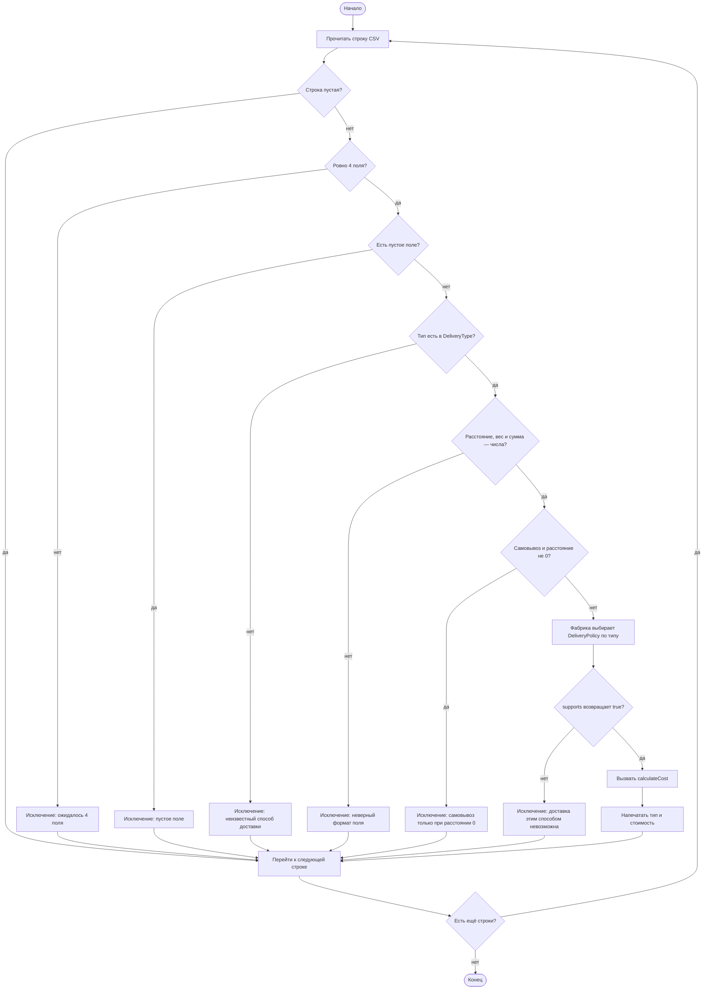
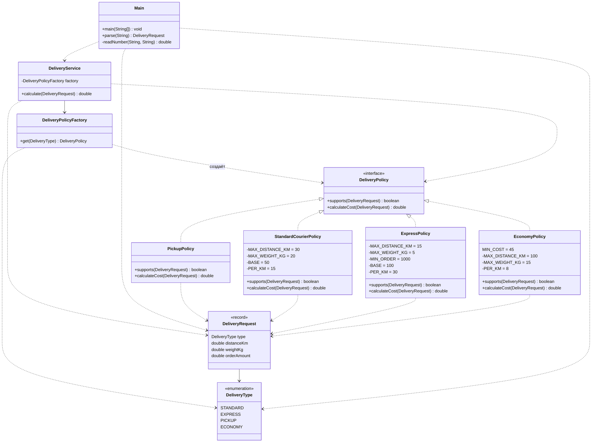

## Activity-диаграмма

```mermaid
flowchart TD
    start([Начало]) --> read[Прочитать строку CSV]
    read --> empty{Строка пустая?}
    empty -->|да| next[Перейти к следующей строке]
    empty -->|нет| fields{Ровно 4 поля?}
    fields -->|нет| errFields[Исключение: ожидалось 4 поля]
    fields -->|да| blank{Есть пустое поле?}
    blank -->|да| errBlank[Исключение: пустое поле]
    blank -->|нет| type{Тип есть в DeliveryType?}
    type -->|нет| errType[Исключение: неизвестный способ доставки]
    type -->|да| number{Расстояние, вес и сумма — числа?}
    number -->|нет| errNumber[Исключение: неверный формат поля]
    number -->|да| pickup{Самовывоз и расстояние не 0?}
    pickup -->|да| errPickup[Исключение: самовывоз только при расстоянии 0]
    pickup -->|нет| factory[Фабрика выбирает DeliveryPolicy по типу]
    factory --> supports{supports возвращает true?}
    supports -->|нет| errSupport[Исключение: доставка этим способом невозможна]
    supports -->|да| cost[Вызвать calculateCost]
    cost --> print[Напечатать тип и стоимость]
    print --> next
    errFields --> next
    errBlank --> next
    errType --> next
    errNumber --> next
    errPickup --> next
    errSupport --> next
    next --> more{Есть ещё строки?}
    more -->|да| read
    more -->|нет| stop([Конец])
```

## Диаграмма классов

```mermaid
classDiagram
    class DeliveryType {
        <<enumeration>>
        STANDARD
        EXPRESS
        PICKUP
        ECONOMY
    }

    class DeliveryRequest {
        <<record>>
        DeliveryType type
        double distanceKm
        double weightKg
        double orderAmount
    }

    class DeliveryPolicy {
        <<interface>>
        +supports(DeliveryRequest) boolean
        +calculateCost(DeliveryRequest) double
    }

    class PickupPolicy {
        +supports(DeliveryRequest) boolean
        +calculateCost(DeliveryRequest) double
    }

    class StandardCourierPolicy {
        -MAX_DISTANCE_KM = 30
        -MAX_WEIGHT_KG = 20
        -BASE = 50
        -PER_KM = 15
        +supports(DeliveryRequest) boolean
        +calculateCost(DeliveryRequest) double
    }

    class ExpressPolicy {
        -MAX_DISTANCE_KM = 15
        -MAX_WEIGHT_KG = 5
        -MIN_ORDER = 1000
        -BASE = 100
        -PER_KM = 30
        +supports(DeliveryRequest) boolean
        +calculateCost(DeliveryRequest) double
    }

    class EconomyPolicy {
        MIN_COST = 45
        -MAX_DISTANCE_KM = 100
        -MAX_WEIGHT_KG = 15
        -PER_KM = 8
        +supports(DeliveryRequest) boolean
        +calculateCost(DeliveryRequest) double
    }

    class DeliveryPolicyFactory {
        +get(DeliveryType) DeliveryPolicy
    }

    class DeliveryService {
        -DeliveryPolicyFactory factory
        +calculate(DeliveryRequest) double
    }

    class Main {
        +main(String[]) void
        +parse(String) DeliveryRequest
        -readNumber(String, String) double
    }

    DeliveryPolicy <|.. PickupPolicy
    DeliveryPolicy <|.. StandardCourierPolicy
    DeliveryPolicy <|.. ExpressPolicy
    DeliveryPolicy <|.. EconomyPolicy
    DeliveryPolicyFactory ..> DeliveryPolicy : создаёт
    DeliveryPolicyFactory ..> DeliveryType
    DeliveryService --> DeliveryPolicyFactory
    DeliveryService ..> DeliveryPolicy
    DeliveryService ..> DeliveryRequest
    DeliveryRequest --> DeliveryType
    Main ..> DeliveryService
    Main ..> DeliveryRequest
    Main ..> DeliveryType
    PickupPolicy ..> DeliveryRequest
    StandardCourierPolicy ..> DeliveryRequest
    ExpressPolicy ..> DeliveryRequest
    EconomyPolicy ..> DeliveryRequest
```
