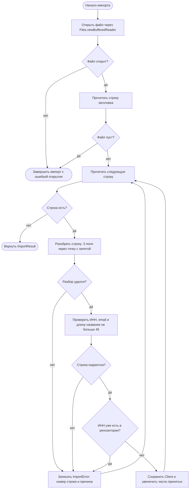
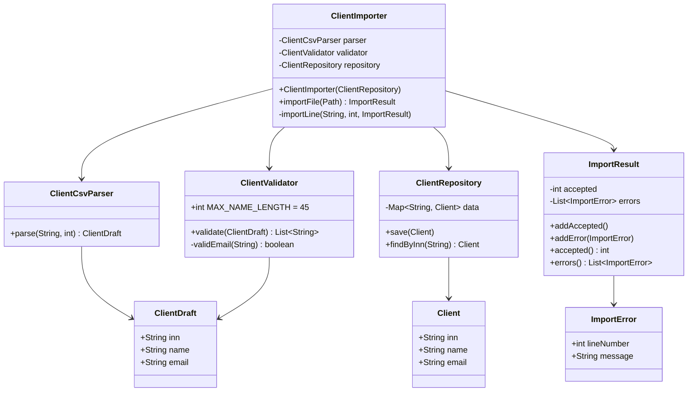

## Activity-диаграмма

```mermaid
flowchart TD
    start([Начало импорта]) --> open[Открыть файл через Files.newBufferedReader]
    open --> opened{Файл открыт?}
    opened -->|нет| fail([Завершить импорт с ошибкой открытия])
    opened -->|да| header[Прочитать строку заголовка]
    header --> empty{Файл пуст?}
    empty -->|да| fail
    empty -->|нет| read[Прочитать следующую строку]
    read --> more{Строка есть?}
    more -->|нет| done([Вернуть ImportResult])
    more -->|да| parse[Разобрать строку: 3 поля через точку с запятой]
    parse --> parsed{Разбор удался?}
    parsed -->|нет| rowErr[Записать ImportError: номер строки и причина]
    parsed -->|да| validate["Проверить ИНН, email и длину названия не больше 45"]
    validate --> valid{Строка корректна?}
    valid -->|нет| rowErr
    valid -->|да| dup{ИНН уже есть в репозитории?}
    dup -->|да| rowErr
    dup -->|нет| save[Сохранить Client и увеличить число принятых]
    save --> read
    rowErr --> read
```

## Диаграмма классов

```mermaid
classDiagram
    class ClientImporter {
        -ClientCsvParser parser
        -ClientValidator validator
        -ClientRepository repository
        +ClientImporter(ClientRepository)
        +importFile(Path) ImportResult
        -importLine(String, int, ImportResult)
    }
    class ClientCsvParser {
        +parse(String, int) ClientDraft
    }
    class ClientValidator {
        +int MAX_NAME_LENGTH = 45
        +validate(ClientDraft) List~String~
        -validEmail(String) boolean
    }
    class ClientRepository {
        -Map~String, Client~ data
        +save(Client)
        +findByInn(String) Client
    }
    class Client {
        +String inn
        +String name
        +String email
    }
    class ClientDraft {
        +String inn
        +String name
        +String email
    }
    class ImportResult {
        -int accepted
        -List~ImportError~ errors
        +addAccepted()
        +addError(ImportError)
        +accepted() int
        +errors() List~ImportError~
    }
    class ImportError {
        +int lineNumber
        +String message
    }

    ClientImporter --> ClientCsvParser
    ClientImporter --> ClientValidator
    ClientImporter --> ClientRepository
    ClientImporter --> ImportResult
    ClientCsvParser --> ClientDraft
    ClientValidator --> ClientDraft
    ClientRepository --> Client
    ImportResult --> ImportError
```