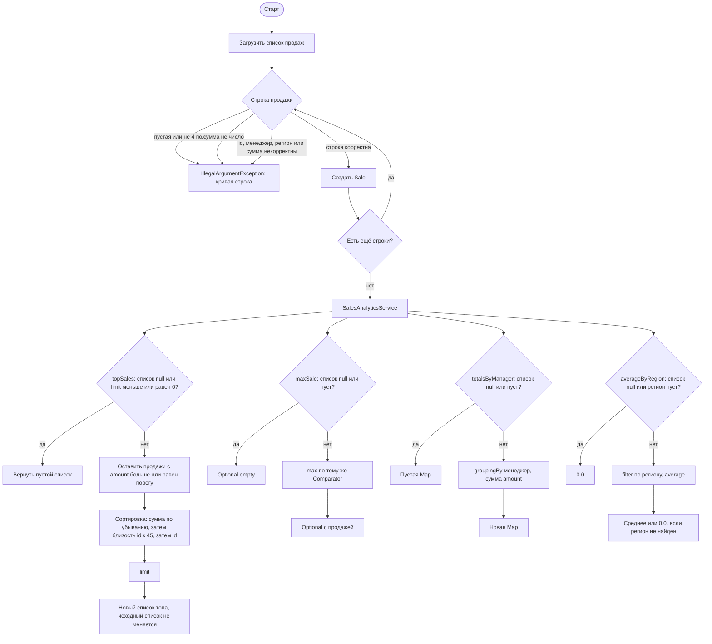
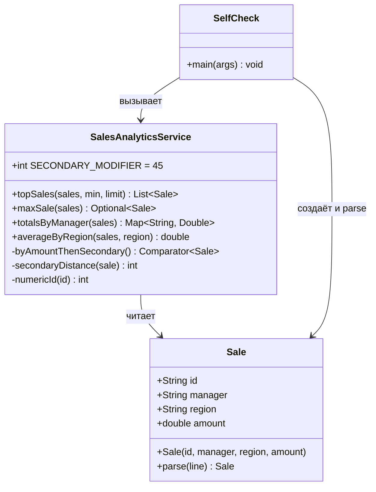

## Activity-диаграмма

```mermaid
flowchart TD
    start([Старт]) --> load[Загрузить список продаж]
    load --> line{Строка продажи}
    line -->|пустая или не 4 поля| bad[IllegalArgumentException: кривая строка]
    line -->|сумма не число| bad
    line -->|id, менеджер, регион или сумма некорректны| bad
    line -->|строка корректна| sale[Создать Sale]
    sale --> more{Есть ещё строки?}
    more -->|да| line
    more -->|нет| svc[SalesAnalyticsService]

    svc --> top{topSales: список null или limit меньше или равен 0?}
    top -->|да| emptyTop[Вернуть пустой список]
    top -->|нет| filter[Оставить продажи с amount больше или равен порогу]
    filter --> sort[Сортировка: сумма по убыванию, затем близость id к 45, затем id]
    sort --> limit[limit]
    limit --> topResult[Новый список топа, исходный список не меняется]

    svc --> max{maxSale: список null или пуст?}
    max -->|да| emptyOpt[Optional.empty]
    max -->|нет| maxCmp[max по тому же Comparator]
    maxCmp --> opt[Optional с продажей]

    svc --> grp{totalsByManager: список null или пуст?}
    grp -->|да| emptyMap[Пустая Map]
    grp -->|нет| group[groupingBy менеджер, сумма amount]
    group --> map[Новая Map]

    svc --> avg{averageByRegion: список null или регион пуст?}
    avg -->|да| zero[0.0]
    avg -->|нет| region[filter по региону, average]
    region --> avgResult[Среднее или 0.0, если регион не найден]
```

## Диаграмма классов

```mermaid
classDiagram
    class Sale {
        +String id
        +String manager
        +String region
        +double amount
        +Sale(id, manager, region, amount)
        +parse(line) Sale
    }

    class SalesAnalyticsService {
        +int SECONDARY_MODIFIER = 45
        +topSales(sales, min, limit) List~Sale~
        +maxSale(sales) Optional~Sale~
        +totalsByManager(sales) Map~String, Double~
        +averageByRegion(sales, region) double
        -byAmountThenSecondary() Comparator~Sale~
        -secondaryDistance(sale) int
        -numericId(id) int
    }

    class SelfCheck {
        +main(args) void
    }

    SalesAnalyticsService --> Sale : читает
    SelfCheck --> SalesAnalyticsService : вызывает
    SelfCheck --> Sale : создаёт и parse
```