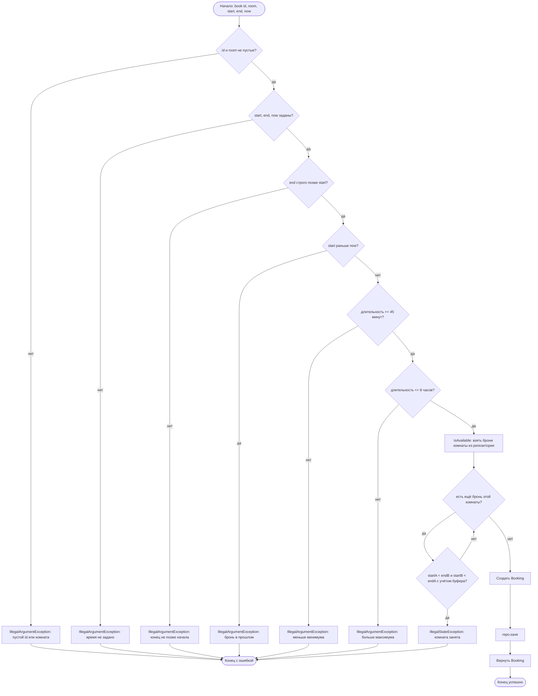
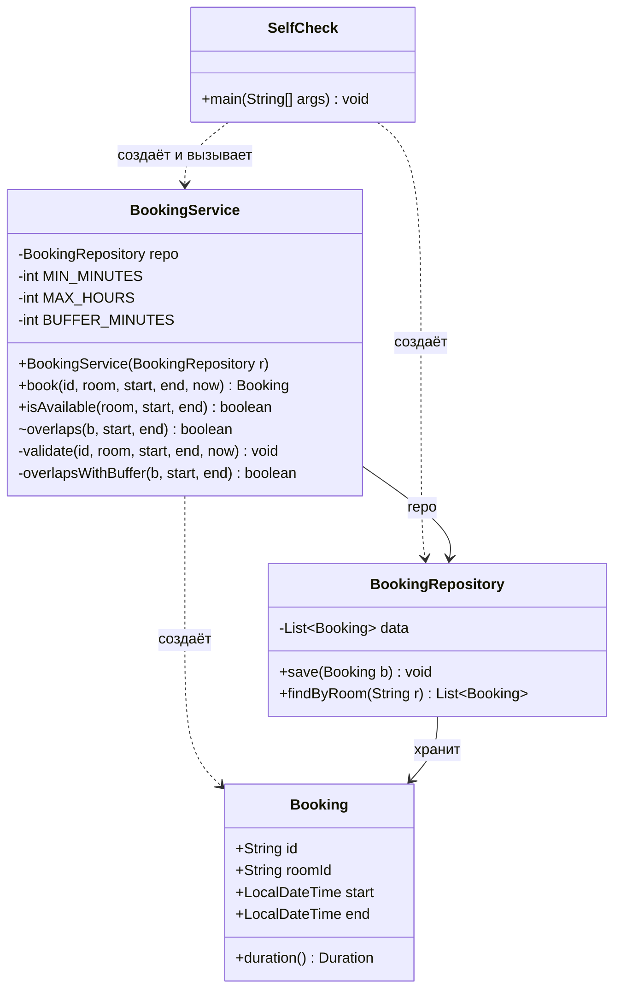

## Activity-диаграмма

```mermaid
flowchart TD
    start([Начало: book id, room, start, end, now]) --> vId{id и room не пустые?}
    vId -->|нет| errEmpty[IllegalArgumentException: пустой id или комната]
    errEmpty --> finErr([Конец с ошибкой])

    vId -->|да| vTime{start, end, now заданы?}
    vTime -->|нет| errNull[IllegalArgumentException: время не задано]
    errNull --> finErr

    vTime -->|да| vOrder{end строго позже start?}
    vOrder -->|нет| errOrder[IllegalArgumentException: конец не позже начала]
    errOrder --> finErr

    vOrder -->|да| vPast{start раньше now?}
    vPast -->|да| errPast[IllegalArgumentException: бронь в прошлом]
    errPast --> finErr

    vPast -->|нет| vMin{длительность >= 45 минут?}
    vMin -->|нет| errMin[IllegalArgumentException: меньше минимума]
    errMin --> finErr

    vMin -->|да| vMax{длительность <= 8 часов?}
    vMax -->|нет| errMax[IllegalArgumentException: больше максимума]
    errMax --> finErr

    vMax -->|да| avail[isAvailable: взять брони комнаты из репозитория]
    avail --> loop{есть ещё бронь этой комнаты?}
    loop -->|да| ov{startA < endB и startB < endA с учётом буфера?}
    ov -->|да| busy[IllegalStateException: комната занята]
    busy --> finErr
    ov -->|нет| loop
    loop -->|нет| create[Создать Booking]
    create --> save[repo.save]
    save --> ret[Вернуть Booking]
    ret --> finOk([Конец успешно])
```

## Диаграмма классов

```mermaid
classDiagram
    class SelfCheck {
        +main(String[] args) void
    }

    class BookingService {
        -BookingRepository repo
        -int MIN_MINUTES
        -int MAX_HOURS
        -int BUFFER_MINUTES
        +BookingService(BookingRepository r)
        +book(id, room, start, end, now) Booking
        +isAvailable(room, start, end) boolean
        ~overlaps(b, start, end) boolean
        -validate(id, room, start, end, now) void
        -overlapsWithBuffer(b, start, end) boolean
    }

    class BookingRepository {
        -List~Booking~ data
        +save(Booking b) void
        +findByRoom(String r) List~Booking~
    }

    class Booking {
        +String id
        +String roomId
        +LocalDateTime start
        +LocalDateTime end
        +duration() Duration
    }

    SelfCheck ..> BookingService : создаёт и вызывает
    SelfCheck ..> BookingRepository : создаёт
    BookingService --> BookingRepository : repo
    BookingService ..> Booking : создаёт
    BookingRepository --> Booking : хранит
```