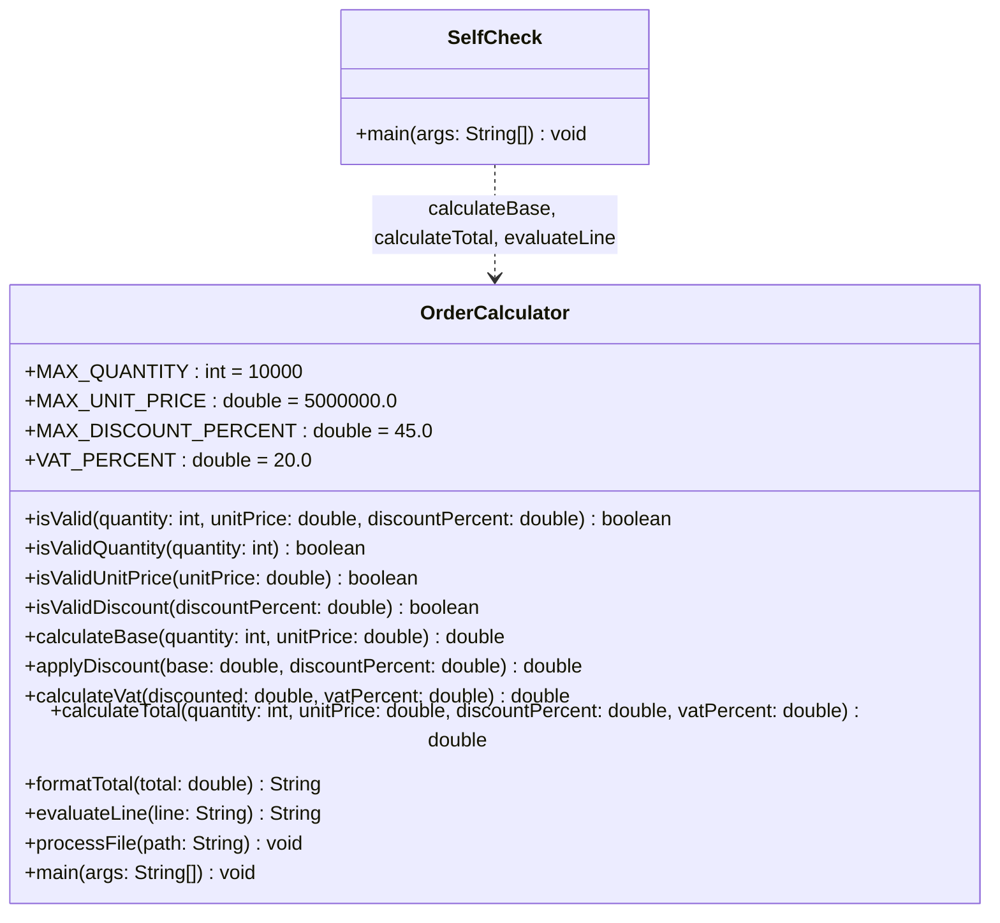

# Диаграмма классов

```mermaid
classDiagram
    class OrderCalculator {
        +MAX_QUANTITY : int = 10000
        +MAX_UNIT_PRICE : double = 5000000.0
        +MAX_DISCOUNT_PERCENT : double = 45.0
        +VAT_PERCENT : double = 20.0
        +isValid(quantity: int, unitPrice: double, discountPercent: double) boolean
        +isValidQuantity(quantity: int) boolean
        +isValidUnitPrice(unitPrice: double) boolean
        +isValidDiscount(discountPercent: double) boolean
        +calculateBase(quantity: int, unitPrice: double) double
        +applyDiscount(base: double, discountPercent: double) double
        +calculateVat(discounted: double, vatPercent: double) double
        +calculateTotal(quantity: int, unitPrice: double, discountPercent: double, vatPercent: double) double
        +formatTotal(total: double) String
        +evaluateLine(line: String) String
        +processFile(path: String) void
        +main(args: String[]) void
    }

    class SelfCheck {
        +main(args: String[]) void
    }

    SelfCheck ..> OrderCalculator : calculateBase, calculateTotal, evaluateLine
```

Оба класса проекта есть на диаграмме. Пороги количества, цены и скидки 45% проверяются в `OrderCalculator` и в `SelfCheck` не дублируются: `SelfCheck` только сверяет ответы.
