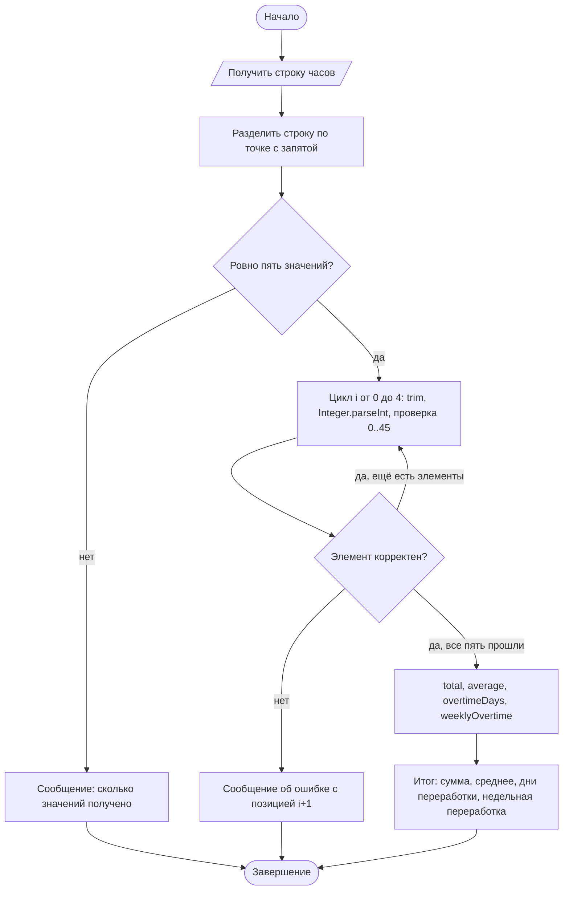
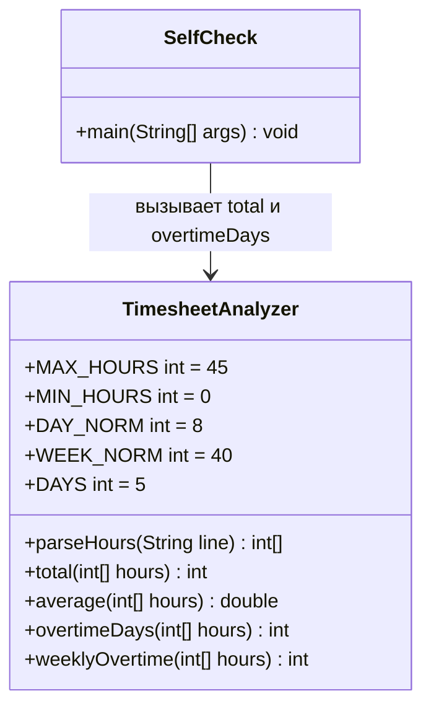

## Activity-диаграмма

```mermaid
flowchart TD
    start([Начало]) --> in[/Получить строку часов/]
    in --> split[Разделить строку по точке с запятой]
    split --> five{Ровно пять значений?}
    five -->|нет| err[Сообщение: сколько значений получено]
    five -->|да| loop[Цикл i от 0 до 4: trim, Integer.parseInt, проверка 0..45]
    loop --> ok{Элемент корректен?}
    ok -->|нет| pos[Сообщение об ошибке с позицией i+1]
    ok -->|да, ещё есть элементы| loop
    ok -->|да, все пять прошли| calc[total, average, overtimeDays, weeklyOvertime]
    calc --> report[Итог: сумма, среднее, дни переработки, недельная переработка]
    report --> finish([Завершение])
    err --> finish
    pos --> finish
```

## Диаграмма классов

```mermaid
classDiagram
    class TimesheetAnalyzer {
        +MAX_HOURS int = 45
        +MIN_HOURS int = 0
        +DAY_NORM int = 8
        +WEEK_NORM int = 40
        +DAYS int = 5
        +parseHours(String line) int[]
        +total(int[] hours) int
        +average(int[] hours) double
        +overtimeDays(int[] hours) int
        +weeklyOvertime(int[] hours) int
    }
    class SelfCheck {
        +main(String[] args) void
    }
    SelfCheck --> TimesheetAnalyzer : вызывает total и overtimeDays
```
