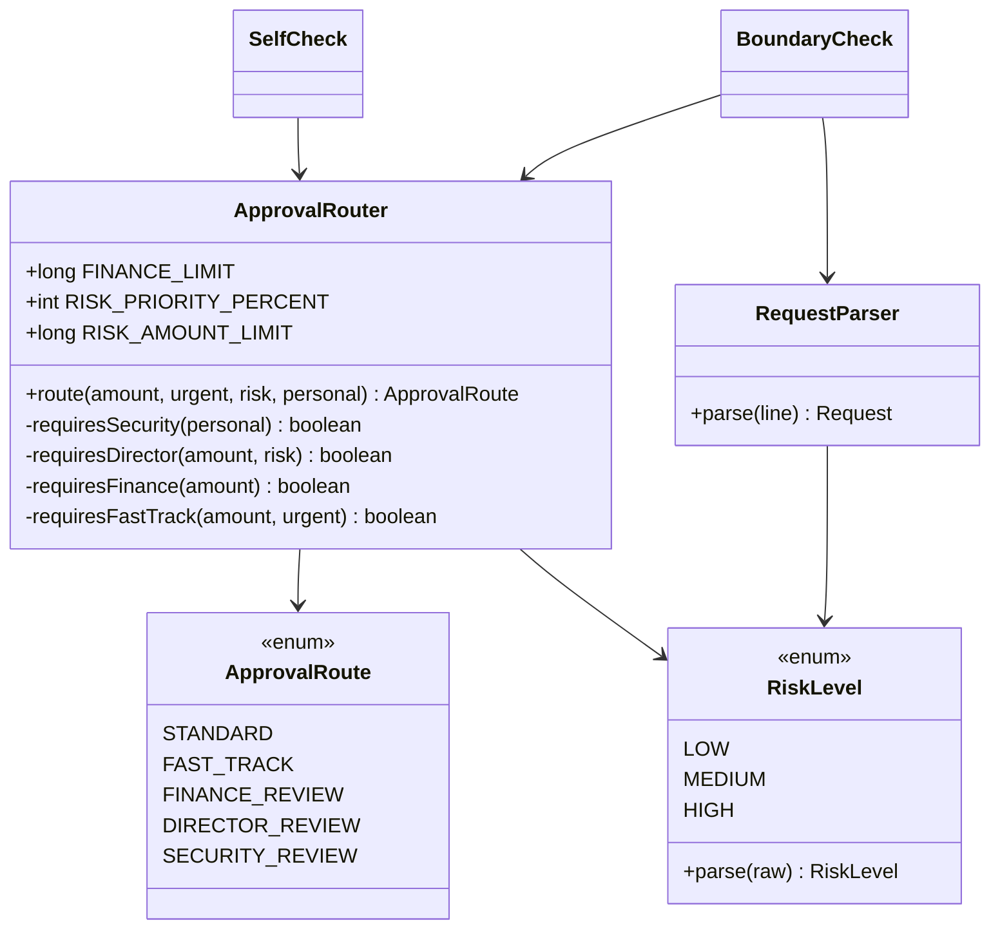

```mermaid
classDiagram
    class ApprovalRouter {
        +long FINANCE_LIMIT
        +int RISK_PRIORITY_PERCENT
        +long RISK_AMOUNT_LIMIT
        +route(amount, urgent, risk, personal) ApprovalRoute
        -requiresSecurity(personal) boolean
        -requiresDirector(amount, risk) boolean
        -requiresFinance(amount) boolean
        -requiresFastTrack(amount, urgent) boolean
    }
    class ApprovalRoute {
        <<enum>>
        STANDARD
        FAST_TRACK
        FINANCE_REVIEW
        DIRECTOR_REVIEW
        SECURITY_REVIEW
    }
    class RiskLevel {
        <<enum>>
        LOW
        MEDIUM
        HIGH
        +parse(raw) RiskLevel
    }
    class RequestParser {
        +parse(line) Request
    }
    class SelfCheck
    class BoundaryCheck
    ApprovalRouter --> ApprovalRoute
    ApprovalRouter --> RiskLevel
    RequestParser --> RiskLevel
    BoundaryCheck --> ApprovalRouter
    BoundaryCheck --> RequestParser
    SelfCheck --> ApprovalRouter
```
