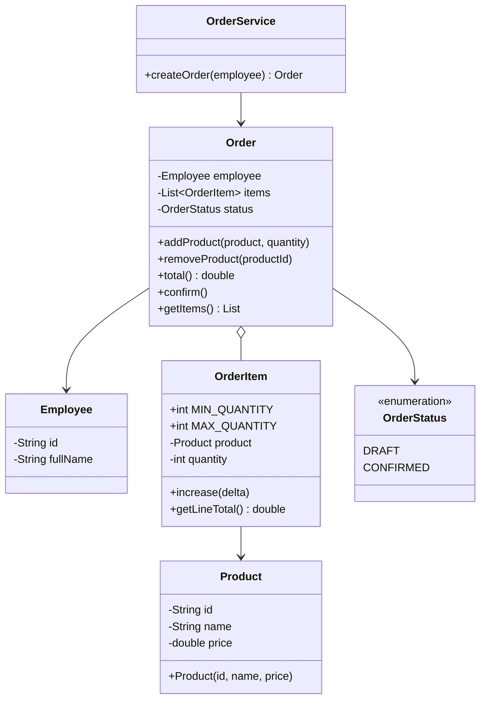
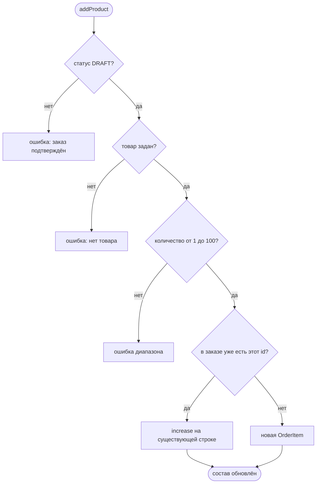

## Диаграмма классов

```mermaid
classDiagram
    class Employee {
        -String id
        -String fullName
    }
    class Product {
        -String id
        -String name
        -double price
        +Product(id, name, price)
    }
    class OrderItem {
        +int MIN_QUANTITY
        +int MAX_QUANTITY
        -Product product
        -int quantity
        +increase(delta)
        +getLineTotal() double
    }
    class Order {
        -Employee employee
        -List~OrderItem~ items
        -OrderStatus status
        +addProduct(product, quantity)
        +removeProduct(productId)
        +total() double
        +confirm()
        +getItems() List
    }
    class OrderStatus {
        <<enumeration>>
        DRAFT
        CONFIRMED
    }
    class OrderService {
        +createOrder(employee) Order
    }
    Order --> Employee
    Order --> OrderStatus
    Order o-- OrderItem
    OrderItem --> Product
    OrderService --> Order
```

## Activity диаграмма

```mermaid
flowchart TD
    startNode([addProduct]) --> draft{статус DRAFT?}
    draft -->|нет| deny[ошибка: заказ подтверждён]
    draft -->|да| product{товар задан?}
    product -->|нет| noProduct[ошибка: нет товара]
    product -->|да| qty{количество от 1 до 100?}
    qty -->|нет| badQty[ошибка диапазона]
    qty -->|да| same{в заказе уже есть этот id?}
    same -->|да| merge[increase на существующей строке]
    same -->|нет| add[новая OrderItem]
    merge --> done([состав обновлён])
    add --> done
```
