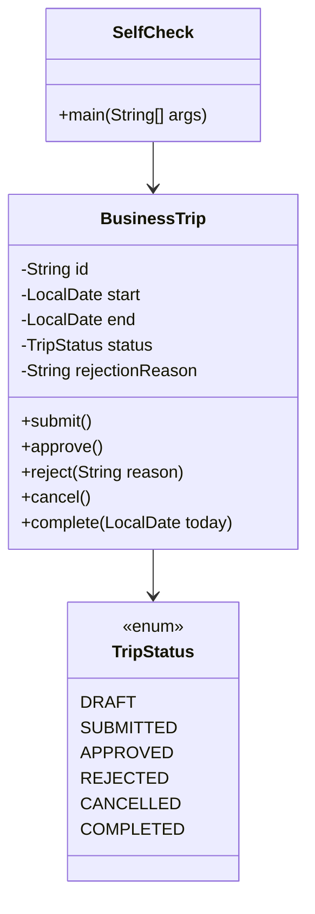
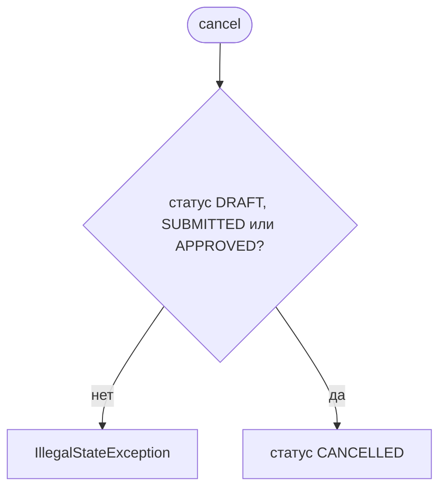

# Диаграмма классов

```mermaid
classDiagram
    class TripStatus {
        <<enum>>
        DRAFT
        SUBMITTED
        APPROVED
        REJECTED
        CANCELLED
        COMPLETED
    }
    class BusinessTrip {
        -String id
        -LocalDate start
        -LocalDate end
        -TripStatus status
        -String rejectionReason
        +submit()
        +approve()
        +reject(String reason)
        +cancel()
        +complete(LocalDate today)
    }
    class SelfCheck {
        +main(String[] args)
    }
    BusinessTrip --> TripStatus
    SelfCheck --> BusinessTrip
```

# Activity-диаграмма

```mermaid
flowchart TD
    startNode([cancel]) --> state{статус DRAFT, SUBMITTED или APPROVED?}
    state -- нет --> badState[IllegalStateException]
    state -- да --> done[статус CANCELLED]
```
