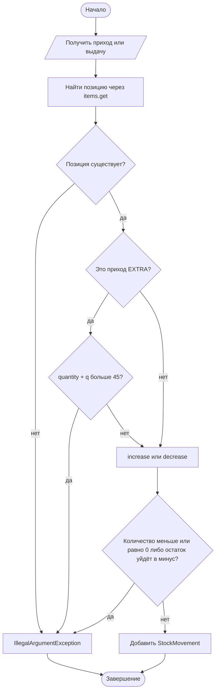
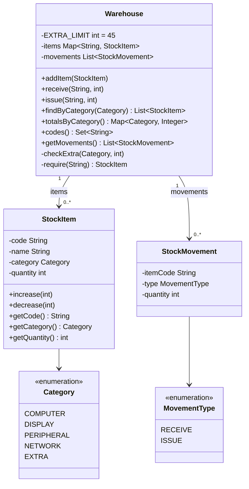

## Activity-диаграмма

```mermaid
flowchart TD
    start([Начало]) --> op[/Получить приход или выдачу/]
    op --> find[Найти позицию через items.get]
    find --> exists{Позиция существует?}
    exists -->|нет| err[IllegalArgumentException]
    exists -->|да| kind{Это приход EXTRA?}
    kind -->|да| limit{quantity + q больше 45?}
    kind -->|нет| upd[increase или decrease]
    limit -->|да| err
    limit -->|нет| upd
    upd --> bad{Количество меньше или равно 0 либо остаток уйдёт в минус?}
    bad -->|да| err
    bad -->|нет| move[Добавить StockMovement]
    move --> done([Завершение])
    err --> done
```

## Диаграмма классов

```mermaid
classDiagram
    class Warehouse {
        -EXTRA_LIMIT int = 45
        -items Map~String, StockItem~
        -movements List~StockMovement~
        +addItem(StockItem)
        +receive(String, int)
        +issue(String, int)
        +findByCategory(Category) List~StockItem~
        +totalsByCategory() Map~Category, Integer~
        +codes() Set~String~
        +getMovements() List~StockMovement~
        -checkExtra(Category, int)
        -require(String) StockItem
    }
    class StockItem {
        -code String
        -name String
        -category Category
        -quantity int
        +increase(int)
        +decrease(int)
        +getCode() String
        +getCategory() Category
        +getQuantity() int
    }
    class StockMovement {
        -itemCode String
        -type MovementType
        -quantity int
    }
    class Category {
        <<enumeration>>
        COMPUTER
        DISPLAY
        PERIPHERAL
        NETWORK
        EXTRA
    }
    class MovementType {
        <<enumeration>>
        RECEIVE
        ISSUE
    }
    Warehouse "1" --> "0..*" StockItem : items
    Warehouse "1" --> "0..*" StockMovement : movements
    StockItem --> Category
    StockMovement --> MovementType
```